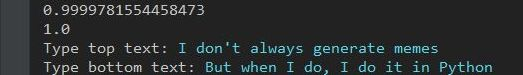
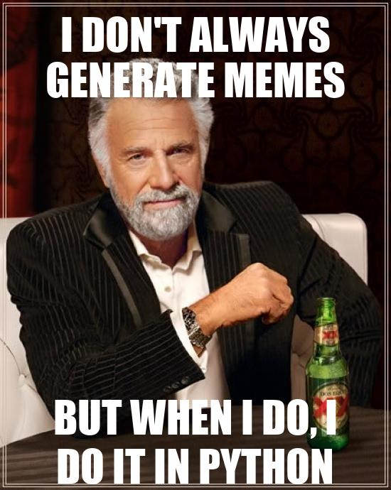

# Python Text to Image

A meme-format generator in Python. Automatically download an image providing an URL, and when it's completed, the app will prompt you for Top and Bottom texts to draw on it, all based on the image height/width and your selected fontsize.

    

After that it will show you the finished result:

    

### To be implemented:
* More text aligning options
* A Graphical User Interface